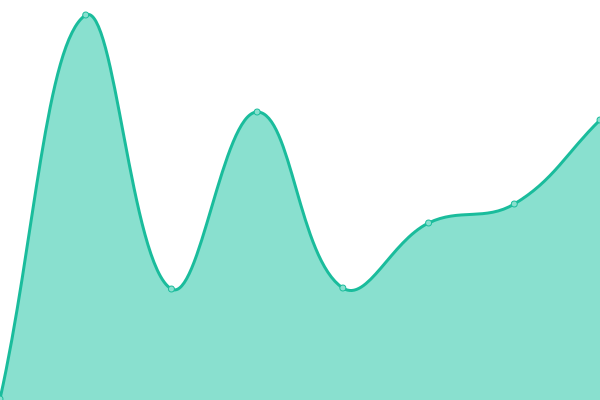
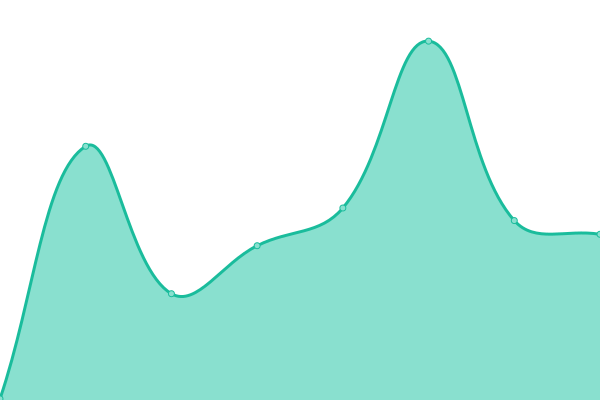

# [📈 Live Status](https://status.hhf.technology): <!--live status--> **🟧 Partial outage**

This repository contains the open-source uptime monitor and status page for [Upptime](https://upptime.js.org), powered by [Upptime](https://github.com/upptime/upptime).

With [Upptime](https://upptime.js.org), you can get your own unlimited and free uptime monitor and status page, powered entirely by a GitHub repository. We use [Issues](https://github.com/upptime/upptime/issues) as incident reports, [Actions](https://github.com/hhftechnology/status/actions) as uptime monitors, and [Pages](https://status.hhf.technology) for the status page.

<!--start: status pages-->
<!-- This summary is generated by Upptime (https://github.com/upptime/upptime) -->
<!-- Do not edit this manually, your changes will be overwritten -->
<!-- prettier-ignore -->
| URL | Status | History | Response Time | Uptime |
| --- | ------ | ------- | ------------- | ------ |
|  [HHF Forum](https://forum.hhf.technology) | 🟩 Up | [hhf-forum.yml](https://github.com/hhftechnology/status/commits/HEAD/history/hhf-forum.yml) | 

 1131ms
     
 | 

<a href="https://status.hhf.technology/history/hhf-forum">100.00%</a>
    

|  [HHF Git](https://git.hhf.technology) | 🟩 Up | [hhf-git.yml](https://github.com/hhftechnology/status/commits/HEAD/history/hhf-git.yml) | 

 1886ms
     
 | 

<a href="https://status.hhf.technology/history/hhf-git">65.92%</a>
    

|  [HHF Cheat-Sheet](https://cheatsheet.hhf.technology) | 🟩 Up | [hhf-cheat-sheet.yml](https://github.com/hhftechnology/status/commits/HEAD/history/hhf-cheat-sheet.yml) | 

 353ms
     
 | 

<a href="https://status.hhf.technology/history/hhf-cheat-sheet">100.00%</a>
    

|  [HHF Notes](https://notes.hhf.technology/) | 🟩 Up | [hhf-notes.yml](https://github.com/hhftechnology/status/commits/HEAD/history/hhf-notes.yml) | 

 223ms
     
 | 

<a href="https://status.hhf.technology/history/hhf-notes">100.00%</a>
    

|  HHF Firewall API | 🟥 Down | [hhf-firewall-api.yml](https://github.com/hhftechnology/status/commits/HEAD/history/hhf-firewall-api.yml) | 

 153ms
     
 | 

<a href="https://status.hhf.technology/history/hhf-firewall-api">100.00%</a>
    

|  HHF Node 1 | 🟩 Up | [hhf-node-1.yml](https://github.com/hhftechnology/status/commits/HEAD/history/hhf-node-1.yml) | 

 682ms
     
 | 

<a href="https://status.hhf.technology/history/hhf-node-1">100.00%</a>
    

|  HHF Node 2 | 🟩 Up | [hhf-node-2.yml](https://github.com/hhftechnology/status/commits/HEAD/history/hhf-node-2.yml) | 

 103ms
     
 | 

<a href="https://status.hhf.technology/history/hhf-node-2">100.00%</a>
    

|  HHF Node 3 | 🟩 Up | [hhf-node-3.yml](https://github.com/hhftechnology/status/commits/HEAD/history/hhf-node-3.yml) | 

 124ms
     
 | 

<a href="https://status.hhf.technology/history/hhf-node-3">100.00%</a>
    

|  HHF Database Cluster Node 1 | 🟩 Up | [hhf-database-cluster-node-1.yml](https://github.com/hhftechnology/status/commits/HEAD/history/hhf-database-cluster-node-1.yml) | 

 217ms
     
 | 

<a href="https://status.hhf.technology/history/hhf-database-cluster-node-1">100.00%</a>
    

|  HHF Database Cluster Node 2 | 🟩 Up | [hhf-database-cluster-node-2.yml](https://github.com/hhftechnology/status/commits/HEAD/history/hhf-database-cluster-node-2.yml) | 

 342ms
     
 | 

<a href="https://status.hhf.technology/history/hhf-database-cluster-node-2">100.00%</a>
    

|  HHF Database Cluster Node 3 | 🟩 Up | [hhf-database-cluster-node-3.yml](https://github.com/hhftechnology/status/commits/HEAD/history/hhf-database-cluster-node-3.yml) | 

 65ms
     
 | 

<a href="https://status.hhf.technology/history/hhf-database-cluster-node-3">100.00%</a>
    

|  HHF HA Proxy Cluster Node 1 | 🟩 Up | [hhf-ha-proxy-cluster-node-1.yml](https://github.com/hhftechnology/status/commits/HEAD/history/hhf-ha-proxy-cluster-node-1.yml) | 

 298ms
     
 | 

<a href="https://status.hhf.technology/history/hhf-ha-proxy-cluster-node-1">98.95%</a>
    

|  HHF HA Proxy Cluster Node 2 | 🟩 Up | [hhf-ha-proxy-cluster-node-2.yml](https://github.com/hhftechnology/status/commits/HEAD/history/hhf-ha-proxy-cluster-node-2.yml) | 

 220ms
     
 | 

<a href="https://status.hhf.technology/history/hhf-ha-proxy-cluster-node-2">100.00%</a>
    

|  HHF HA Proxy Cluster Node 3 | 🟩 Up | [hhf-ha-proxy-cluster-node-3.yml](https://github.com/hhftechnology/status/commits/HEAD/history/hhf-ha-proxy-cluster-node-3.yml) | 

 234ms
     
 | 

<a href="https://status.hhf.technology/history/hhf-ha-proxy-cluster-node-3">100.00%</a>
    

|  HHF Podman Node 1 | 🟩 Up | [hhf-podman-node-1.yml](https://github.com/hhftechnology/status/commits/HEAD/history/hhf-podman-node-1.yml) | 

 611ms
     
 | 

<a href="https://status.hhf.technology/history/hhf-podman-node-1">100.00%</a>
    

|  HHF Podman Node 2 | 🟩 Up | [hhf-podman-node-2.yml](https://github.com/hhftechnology/status/commits/HEAD/history/hhf-podman-node-2.yml) | 

 2226ms
     
 | 

<a href="https://status.hhf.technology/history/hhf-podman-node-2">99.60%</a>
    

<!--end: status pages-->

[**Visit our status website →**](https://status.hhf.technology)

## 📄 License

- Powered by: [Upptime](https://github.com/upptime/upptime)
- Code: [MIT](./LICENSE) © [Anand Chowdhary](https://anandchowdhary.com), supported by [Pabio](https://pabio.com)
- Data in the `./history` directory: [Open Database License](https://opendatacommons.org/licenses/odbl/1-0/)
